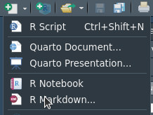
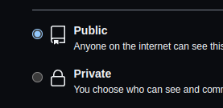
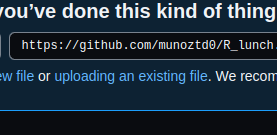
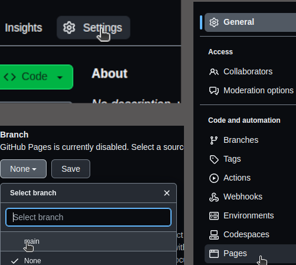
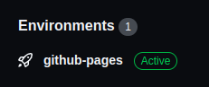
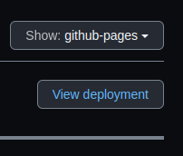
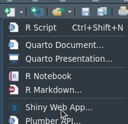
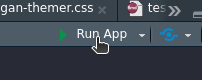

```{r setup, include=FALSE}
options(htmltools.dir.version = FALSE)
knitr::opts_chunk$set(
  fig.width=9, fig.height=3.5, fig.retina=3,
  out.width = "100%",
  cache = FALSE,
  echo = TRUE,
  message = FALSE, 
  warning = FALSE,
  hiline = TRUE
)
```

```{r xaringan-themer, include=FALSE, warning=FALSE}
library(xaringanthemer)

#style_mono_accent_inverse(base_color = "#3C989E")

```


<style>
footnotes {
  position: absolute;
  bottom: 0;
  margin-bottom: 10px;
  width: 80%;
  color: #3C989E;
  font-size: 1em;
}
</style>


# Today's Workshop

.left-column[

<br />


]


.right-column[
+ ### Interactive
{{content}}

]

--

+ ### Just the tip of the iceberg
{{content}}

--

+ ### Don't hesitate to interrupt
{{content}}

--

+ ### Different levels

---


# dɪˈplɔɪmənt


<br /> 

### <h3 align="center">Web deployment is the process of deploying the code (html, python, javascript, **R**, etc... ) from **your** machine to a **hosting** platform. </h3>

<br />
 
<center></center>


---
name: WHY

# Why ?


.right-column[
+ ### Transparency
{{content}}

]

--

+ ### Shareability
{{content}}

--

+ ### Reproducibility 
{{content}}

--

+ ### Availability


---
class: inverse center middle

# Version Control - Git


---

<footnotes align="center">

<strong> Version Control </strong>  -  Github Pages  -  Shiny Apps - Posit Cloud 

</footnotes>


.left-column[
<br />

## You don't need to use it...
<br />

### But you should...
<br />


##### `But you are gonna regret it if you don't ...`
]


.right-column[

# <h1 align="center"> Version Control

<br /><br /><br />

<center></center>

]

---

# Create a Github Account

<footnotes align="center">

<strong> Version Control </strong>  -  Github Pages  -  Shiny Apps - Posit Cloud 

</footnotes>

<br />

- ### [GitHub Signup](https://github.com/signup?user_email=&source=form-home-signup) - We will need it later on..

- ### [Set Up RStudio with Git](https://happygitwithr.com/ssh-keys.html) 
It is quite annoying and technical, so **we will not go through it now** but don't hesitate to ask me questions about it after the workshop

<br />
<br />

Of course many alternatives to GitHub: [Gitlab](https://gitlab.com/users/sign_in), [Atlassian Bitbucket](https://id.atlassian.com/login?)


---
class: inverse center middle

# GitHub Pages

<center></center>


---

# Very Simple Way to Host You Reports

<footnotes align="center">

 Version Control  - <strong> Github Pages </strong>   -  Shiny Apps - Posit Cloud 

</footnotes>


.left-column2[

+ ### Open up Rstudio 
{{content}}

]

.right-column2[

<center></center>

<br /> 

<center></center>


]

--
+ ### Create new RMarkdown file
{{content}}
--
+ ### Choose "HTML output"
{{content}}
--
+ ### Modify whatever ..
{{content}}
--
+ ### Knit it like it's hot !


---

# Very Simple Way to Host You Reports - 2

<footnotes align="center">

 Version Control  -  <strong> Github Pages </strong>  -  Shiny Apps - Posit Cloud 

</footnotes>


.left-column2[

+ #### Rename the \*.html file that you just created **index.html**
{{content}}

]

.right-column2[

<center></center>

<br />

<center></center>

<br /> 

<center></center>

]

--
+ #### Go to your GitHub profile under **Repositories**
{{content}}
--
+ #### Click on the **New** button (the green one on the top right)
{{content}}
--
+ #### Name it **R Lunch** or whatever...
{{content}}
--
+ #### Make sure it's **public**
{{content}}
--
+ #### Click on **create repository** | Bravo ! (if you just create your first repository)
{{content}}
--
+ #### And click on **uploading an existing file** and choose the **index.html** file
--

---

# Very Simple Way to Host You Reports - 3

<footnotes align="center">

 Version Control  -  <strong> Github Pages </strong>  -  Shiny Apps - Posit Cloud 

</footnotes>


.left-column4[

+ #### Now go to -> **Settings**
{{content}}

]

.right-column4[



]

--
<br /> 
+ #### Click on **Pages** 
{{content}}
--
<br /> 
+ #### Then under **Branch** click on **none** and select **main**
{{content}}
--
<br /> 
+ #### Finally just press on **Save**
--

---

<footnotes align="center">

 Version Control   -  <strong> Github Pages </strong> -  Shiny Apps - Posit Cloud 

</footnotes>


.left-column4[
<br /><br />
## Now we wait...
<br />


### Let every body catch up 
]

.right-column4[
<br />


<center></center>
]


---

# Check out your Personal Page !

<footnotes align="center">

 Version Control  -  <strong> Github Pages </strong>  -  Shiny Apps - Posit Cloud 

</footnotes>


.left-column4[

+ #### Back in the main page of your repo you should see a new infos: ** Environments**
{{content}}

]

.right-column4[

<center></center>

<br />

<center></center>

]

--
<br /> 
+ #### Click on **github-pages** under **Environments**
{{content}}
--
<br /> 
+ #### Then click on **View deployment**
{{content}}
--
<br /> 
+ #### Here you go, you're a Full Stack Web Developer now !
--

---


class: inverse center middle

# Shiny Apps


---


# Build an App

<footnotes align="center">

 Version Control  -   Github Pages  -  <strong> Shiny Apps </strong>  - Posit Cloud 

</footnotes>


.left-column2[

+ #### Back in **Rstudio** click on **new file** and **Shiny Web App**
{{content}}

]

.right-column2[

<center></center>

<br /> 

<center></center>


]

--
<br /> 
+ #### You can play around and click on **Run App** to test it
{{content}}
--
<br /> 
+ #### For those who are already a bit comfortable with Shiny and or Echarts4r

You can go to []()
{{content}}
--
<br /> 
+ #### Here you go, you're a Full Stack Web Developer now !
--


---


class: inverse center middle

# Posit Cloud


---
class: center, middle

# Thanks!

Slides created via the R packages:

[**xaringan**](https://github.com/yihui/xaringan)<br>
[gadenbuie/xaringanthemer](https://github.com/gadenbuie/xaringanthemer)
